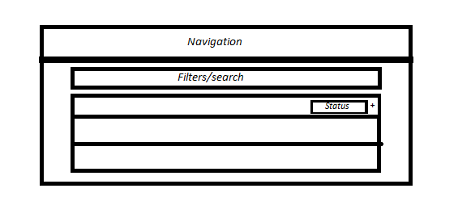

# Lean MEAN Client Machine

## Sprint ~ 1.5 ~

## Dependencies
- [Heroku CLI](https://devcenter.heroku.com/articles/heroku-cli)
- [npm 6.x](https://nodejs.org/en/)

## Installation
- Clone
- First Installation
    - Run `npm run first-install`
- Any other time
    - Run `gulp` for automatic server and front end restart every time after that
- Deployments will happen on every push to master (`git push origin master`)

## TODO
### Profile Creation:
- Required: First+Last Name, DOB, and Drivers License #
- Optional: email (should still be there)
- CHANGE TO MOCKUP: No adds on signup page
- Need Different signup for admins (same view, different backend implementation). **to figure out**.
    - Basic admin email: autowisecars@yahoo.com. 

### DB Structure
- Users
    + username : string
    + passwords : hash
    + isAdmin : bool
    + loans : other DB object/array of ids of loans, 1+ possible

+ Loans
    - Status : enum?/strings. 
        - MUST BE VISIBLE on description/without clicking on them
        - They can be
            + RECEIVED/SUBMITTED
                - RECEIVED => FROM OFFICE
                - SUBMITTED => FROM BANK
            + PENDING => everything in the process
            + VERIFIED => REVIEWED APP, things are ok
            + APPROVED/DENIED
        + Archived : bool. True if (APPROVED/DENIED)
    - Costs
        - Taxes
        - Warranties ? => CHECK PICTURES. NEED MORE DETAILS
    - Types
        - Auto Loan
        - Repair
        - Admin - need more details on this. Administrative fees?
    - Trades
        - default to false/'[]' (empty array - which is 'falsey')
        - ADMIN puts in trade information later
    - Messages
        - Content : array with messages in reverse chronological order (easy to flip in angular)
            + Need more clafication of what to put 'on top' as important message
        - Date/timestamps - format tba later. not that important
        - visibleToConsumer : bool
        - important : bool
        - CHANGE TO MOCKUP: Same area as normal info

* Admin view:
    - Have to be able to change/add the above
    - On edit, there should an checkbox that decides whether to email the customer (if they have an email) or not about the update.
    - **REACH**: Option to text the customer. This will **co$t** (twilio etc).

### Ads were never mentioned on the last phone call

### Admin Portal
- Should be able to see ALL loans
    + One tab for current ones
    + One for archived ones (APPROVED/DENIED)
    + **REACH**: Search for them. maybe it'll be simple with angular filtering??
- Be able to put notes
    - Common ones that need to be put as part of dropdown of possible options:
        - INSURANCE
        - CO-SIGNER
        - TAG #
        - COPY OF DD - need to handle image submission - need a Heroku add-on (S3 from AWS?)
            + There's a bower module called `ng-file-upload` in the public folder
    - Display this on the top under the basic loan info as 'WHAT WE NEED NEXT'
    - Multiple/1+ of these possible

I'm thinking of something like this, with *click* and expand functionality

### Later need to figure out CNAME subdomain forwarding

### Agreed Development/Git Information
- Naming Conventions
    - Code: CamelCase
    - Branch Names: ALL LOWERCASE, '_' FOR SPACES, **sprint'#'_feature_name**
    - On sprint end: Optionally, merge feature branches with the master

Others from [*sprint 1 README*](https://github.com/MEAN-Script-Org/sprint1/blob/master/README.md)

