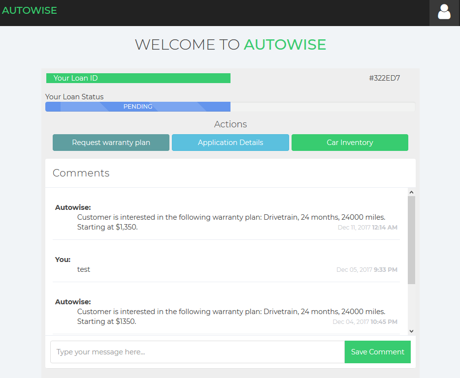

<!-- make non-local hrefs open new tabs -->

# TODOs for successful client transition
  + Sign up for [Heroku](https://signup.heroku.com/)
  + Become a collaborator to our current project (need email)
  + Transfer project ownership
  + Know how to modify/remove Heroku variables
    + [Instructions](#soon)
  + Get email variables for automated emailing 
    + [Instructions](#soon)
  + Link inventory website to https://autowise.herokuapp.com
  + All of this will cost you:
    + $0/month **_for now_**, until database capacity is reached (512MB)
    + Prices of current database provider (mLab) then start at $15/month/GB
  + Enjoy your paperless loan tracking application

## Scaling Recommendations
- Instructions to move to a bigger database of the current provider can be found [here](https://devcenter.heroku.com/articles/mongolab#changing-plans)
  - Recommended Implementation: Have archived loans as a static JSON/mongodump file in a S3 bucket or similar storage/CDN service. Only retrieve them when searching for them, and modify that file as such. Then accordingly modify 'archived_filter' on *custom-filters.js*, reset loading, add a new Factory ↔ Express interaction, and add/remove loans to active MongoDB on loan 'revival' or death.
    - *Learning opportunity* if no prior experience with these services

<!-- TO Add to heroku vars: -->
<!-- email text!!! -->
<!-- token expiration time!!! -->

<!-- 'Fun' future features -->
<!-- Features for the future -->
<!-- Date filters based on updated_at or the like -->
<!-- auto logout ... etc -->

<!-- # Lean MEAN Client Machine Presents:  -->
# Autowise Loan Tracking Documentation

## Table of Contents
<!-- 
  easily done in sublime by: 
    Multi selecting all "# ", then select current line (Ctrl+Shift+L)
    then paste to another page, edit there, then paste back here :D
-->
+ [Summary](#summary)
+ [App Functionality Abridged](#app-functionality-abridged)
    * [Loan Management](#loan-management)
        - [Creating Loans](#creating-loans)
        - [Buyer's Order](#buyers-order)
        - [Modifying Loans](#modifying-loans)
        - [Comments on Loans](#comments-on-loans)
        - [Warranties - Admin](#warranties---admin)
        - [Mass Loan Operations](#mass-loan-operations)
    * [Warranties - customer](#warranties---customer)
    * [User Management](#user-management)
+ [Technical details](#technical-details)
    * [Project Dependencies](#project-dependencies)
    * [Development](#development)
    * [Borrowed Code](#borrowed-code)
    * [Project Structure](#project-structure)
    * [Overall Comments & Implementation Tweaks](#overall-comments--implementation-tweaks)
    * [Testing](#testing)

## Summary
<!-- high level feature/user-stories summary -->
This application is intended as the paperless replacement for loan applications for Autowise, an used-card dealership in Tallahassee, Florida. It also provides Autowise's customers the ability to track their application details, so they can login online whenever they want, and check their application and comments (updates, requests for more information) instead of flooding the phone lines.

Autowise customers (further referred to as 'customers') are able to:
- Create an account
- View their loan application status and their loan's buyer's order details
- Make and see any comments they wrote, along with seeing non-admin comments
- View the account details they signed up with

Autowise employees ('admins') are also be able to: 
- Change loans status - even archive them
- Find and update loans
- Assign and update warranty plans to loans
- Make and remove their own comments
- Email customer(s) about changes to their application

Autowise managers ('super admins'), in addition to admins privileges, have the ability to:
- Delete any comments (expect for system's)
- Delete Loans
- Delete any user account
- Assign and revoke 'customer', 'admin', and 'super admin' privileges to any  user account.

## App Functionality Abridged

### Loan Management
#### Creating Loans

From the **admin view**, you start the load creation process by first clicking the button on the lower right corner of the page (as pictured above). Clicking this button opens the Buyer's Order modal.

#### Buyer's Order

Modal that once completed, creates a loan in the system.

Loans will be automatically assigned to customers **once a customer creates an account with matching full name (they must be EXACT, case and empty spaces included) and DOB of an EXISITING purchaser or copurchaser's name and DOB buyers order.** The Loan-User match does **not** take the customer's driver's license number into consideration, although this may easily be implemented in *loans.crud.js*.

#### Modifying Loans

If you're an admin, all Loans in the database can be accessed be seen once you login. When a loan *row* is click, it will expand and the picture above will appear. From there you can:
- Edit the original Buyer's Order with the _Buyer's Order_ button. Changing names and DOBs here will **not** connect this loan to customer accounts with the new information. See more [here](#somewhere)
- Send a generic email to the purchaser and copurchaser *ONLY* if their emails are listed on the buyer's order.
- Assign a warranty to this loan. After one is assigned, the grey section under "Warranty plan" will appear.
- Change the loan status

> Updates to the purchaser/copurchaser's name or DOB will **not** result on automatic updates to possible users. This only happens loan or account CREATION. Modifying this will need some routing work (easy-medium difficulty).

#### Comments on Loans

Comments are created by clicking "Save comment". Comments are shown reverse chronological order. Both customers and admins can create and see normal comments. Admin can also create comments that will only be visible other admins and not the customer. This is shown in each row as '**Admin Only**'.

- Customers **cannot** delete their comments.
- Admins can only delete their  **own** comments.
- Super admins can delete everyone's comments, except for System's.

#### Changing Loan Status
A Loan's status can be changed with the _Change Status_ button. The popup below will then later appear and that prompt you to select one of the 7 Loan statuses:
- Received
- Submitted
- Pending
- Verified
- Approved
- Denied
- Archived

Confirming this popup updates the Loan to the selected status

<!-- have a user section -->
<!-- 
When a customer is logged in, they are presented with the **customer view**. A customer cannot create, modify, or delete any loans and may only see loans associated with their account. A customer may publish comments, as discussed in the following section.

> Screenshot of the customer view when they login. It will show their loan status, their warranty plan if they have one, as well as the comments.
 -->

<!-- I stop 'abridging' here -->

#### Warranties - Admin

A warranty plan may also be added to a Loan with the _Change Warranty_ button. A popup appears with input fields for a warranty plan type, duration, mileage, and cost. Confirming this popup updates the Loan with a warranty plan, or updates the existing plan if there was already one.

#### Mass Loan Operations
Each Loan header has a checkbox to the left. Click this box to select or unselect the Loan.

If a Loan is selected, when you hover over the circular "+" button in the lower right corner of the **admin view**, several additional buttons are revealed.
- The *pencil* button opens the change status popup as discussed in the Modifying Loans section. Confirming this popup will change all selected Loans to the status specified in the dropdown.
- The *box* button archives all selected Loans.
- The *trash* button (only visible to a _Super Admin_) deletes all selected Loans permanently.

#### Warranties - Customer
A customer may request a warranty plan on a specific loan by clicking the _Request a warranty plan_ button near the top of the loan. This takes the customer to the **customer loan view**. In this area, the customer searches for a warranty plan of interest based on criteria of plan type and car age and make. Available warranty plans are automatically filtered below and a customer selects one they are interested in. Upon selecting, a popup appears listing the warranty plan details and a confirmation button. When the button is clicked, an email with the warranty plan details is sent to Autowise and a comment is added to the loan with the requested plan information.

Once an admin reviews the plan, they may approve it by added a warranty plan to the specified loan, as described in the [Warranties-Admin](#warranties---admin) section

### User Management

#### User Creation and Types
Users are created by _registering_ on the login page. To create an account, a person must specify their name, a username, their DOB, and DL number (email is optional). To access your account, you login on the **login page** with your specified username and password. The app does not have the ability to recover passwords, so _do not forget your password!_

> Screenshot of the login page. You must enter a valid username and password in order to login.

> Screenshot of the Registration page. You must enter something valid for all of the required fields in order to register.

Upon registering, a User is assigned the role of a _customer_ who may view their loans and request warranty plans. When logged in as an _admin_, you may see all the loans in the database and make modifications to them. When logged in as a _super admin_, you have all of the privileges of admins in addition to the ability to delete loans, delete any comments, and change permissions of other users.

#### User Permissions and Account Management
To change permissions, access the *user permissions view* as a super admin. Here you may search for an existing user based on name or username and change their role to customer, admin, or super admin. You may also delete User accounts (note that deleted accounts _may not be recovered_)

> Screenshot of the admin user permissions page. On this page super admins can change the status of any user to a regular customer, admin, or super admin, as well as delete users completely.

## Technical details

### Project Dependencies
- [Node.js and npm](https://nodejs.org/en/download)
- [Heroku CLI](https://devcenter.heroku.com/articles/heroku-cli#download-and-install)
- [Python 3.x](https://www.python.org/downloads/) for automated tests
<!-- I need to figure out protractor webdriver with Selenium ~ ~ -->

### Development
- Clone or Download
- Connect to Heroku
    + Run `heroku login` to authenticate into your Heroku account.
    + Connect to a app: `heroku git:remote -a [heroku app name]`
        * Gulp will **NOT** work if you don't do this (and by extension **NOTHING WILL**). There are ways around this once you acquire the environmental variables
    + For project duplication: You **MUST** be added as a collaborator on the project, and have specific config variables defined in order for this to work. These variables are referred in the backend code as `process.env.VARIABLE_NAME`, and they are:
        * Database: MONGODB_URI
        * Emailing:
            - Yahoo: YAHOO_USERNAME and YAHOO_PASSWORD (not real password, see instructions)
            - Gmail: GMAIL_USERNAME, GMAIL_PASSWORD (**real password**) and CLIENT_ID. I'd recommend to at least b64-encode your password since you will have to store it in plain text (`atob` and `btoa` node packages do this in the backend for you).
            - Instructions how to obtain these can be found [here](#somewhere)
            <!-- Marcial: TODO soon -->
- Installation and Execution
  + First run: `npm run first-install`
      * Make sure **NOT** to have the project tree open in an IDE/Text Edition (e.g. [Sublime Text 3](http://sublimetext.com), or any of other crappier alternative kids use these days). If issues persist after closing it try to run the command with admin privileges
  + Any other time: `gulp`. [Gulp](https://gulpjs.com/) provides automatic server and front-end restarts after local file changes
      * For a cleaner command line, it helps if you add the clearing command of your OS first (`cls` on Windows, `clear` on Unix), then command separator (`;` or `&&`), and THEN `gulp`
- Deployments
  + Automatically on every push to master if you have set up automatic deployment in Heroku
    * [Instructions](https://youtu.be/_tiecDrW6yY?t=179)
    * TL;DW: Heroku → App → Deploy tab → On 'Deployment method' select 'GitHub' → Connect to GiHub → Search your repo → 'Connect' → 'Automatic deploys' → 'Enable automatic deploys'
  + Manually once connected with Heroku's git: 
    * `git push heroku master`
- Testing
    + First time: `npm run first-tests`
    + Later: `npm run tests`

### Borrowed Code
- Boilerplate project was based off a modified and completed [Assignment 5](https://github.com/CEN3031-spr16/Assignment-5).
- Most static dependencies are listed in *package.json*, and downloaded in *client/fonts* and *client/dependencies*.
- Styling templates: Bootstrap, and the [Lumino](https://medialoot.com/item/lumino-admin-bootstrap-template/) template.
- *md5-device-fingerprint.js*: File used to calculate a browser-specific MD5 hash. [Source](https://gist.github.com/splosch/eaacc83f245372ae98fe).
- Other code sections were borrowed from StackOverflow, and used throughout our app. A their source was provided in a comment if so.

### Overall comments & Implementation tweaks
- TBFuther explained
- *Main parts of the app (Factory and Modals monolith, Express)*
- *EJS and path passing*
- *Authentication description*
- Custom Frontend:
  - Checkbox to search query functionality
  - Material design floating (& hidden) menu button(s)
  - Selection/checkbox for mass data manipulation (mass update, delete, archive, etc.)
    - On click event for checkbox and updates local mass list based on the checkbox's checked value.
  - Material design inputs and drop down selectors

<!-- 
  @Max: check if you can put this somewhere else in the app functionality. Gotta AT LEAST STRESS Material design somewhere.
  - Checkbox to search query functionality
  - Material design floating (& hidden) menu button(s)
  - Selection/checkbox for mass data manipulation (mass update, delete, archive, etc.)
  - Material design inputs and drop down selectors
 -->

### Project Structure
The following details the folder structure of the application and the purposes of each file. File names are _italicized_

- _.env:_ Sensitive environment variables hosted in Heroku (present in compiled project, not on Git repo)
- _Procfile:_ Heroku installation instructions
- _gulpfile.js:_ Gulp settings. Automatic server and browser reload on local file changes
- _server.js:_ top-level file that starts the server and runs the application
- _package.json:_ Details Node.js dependencies that will be downloaded under 'node_modules'
- _package-lock.json:_ Extension of above *package.json*
- _README.md:_ Open it and find out
- _test.py:_ Automated testing logic
- client: files and scripts run or viewed on the client (user) side
  + angular: Angular code driving customer views
    * _account.controller.js:_ drives functionality of the user info view
    * _admin.controller.js:_ drives functionality of the admin loan database view
    * _app.js:_ registers the module app which all controllers belong to
    * _controller-template.js:_ template file for additional controllers
    * _customer.controller.js:_ drives functionality of the customer loan view
    * _custom-filters.js:_ drives functionality of the admin loan filtering
    * _factory.js:_ handles requests from the client to the server and back. Methods defined here are used in nearly every controller
    * _login.controller.js:_ drives functionality of the login and registration view
    * _nav.controller.js:_ drives functionality of website navigation
    * _permissions.controller.js:_ drives functionality of the super admin edit account permissions view
    * _warranties.controller.js:_ drives functionality of the customer warranties request view
  + css: CSS styles
    * _styles.css_: Main CSS file
    * _accord.css_ & _component.css_: Other CSS files
  + fonts: fonts used by CSS files, primarily called from _component.css_
  + dependencies: Angular JavaScript source
  + js: additional JavaScript dependences
    + _md5-device-fingerprint.js:_ Priorly explained external dependency used with for custom token-based authentication.
  + partials: smaller chunks of HTML content later incorporated into main views
    * _header.ejs:_ Global HTML `<head>` content
    * _footer.ejs:_ Global JavaScript dependencies
    * _nav.ejs:_ Navigation bar atop each page
    * _accordion-comments.ejs:_ HTML for loan content and comments functionality
    * _actions-row.ejs:_ action buttons appearing under the header of a loan visible to admins
    * _admin-filters.ejs:_ admin loan filtering and search bar
    * _buyers-order.ejs:_ popup displaying the Buyer's Order
    * _google_buttons.ejs:_ admin loan hover create/edit/delete buttons
    * _modals.ejs:_ various modals/popups/dialogs
    * _progress-row.ejs:_ unused now?? -> will be used for customer view
    * _warranty-row.ejs:_ the warranty plan on a loan under the loan header
  + resources: images and other miscellaneous files
  + _account.ejs:_ user account information view 
  + _admin.ejs:_ admin loan database view (also referred to as the **admin view**)
  + _customer.ejs:_ customer loan view (also referred to as the **customer view**)
  + _login.ejs:_ login and register view
  + _permissions.ejs:_ super admin account management view
  + _warranties.ejs:_ customer warranty plan request view
- documentation: resources used in this document
- node_modules: Imported required Node modules. Don't mess with this folder (present in compiled project, not on Git repo).
- server: files and scripts run on the server side
  + db: files defining database objects and server-side database operations
    * _loans.crud.js:_ details CRUD operations on Loan database objects
    * _loans.model.js:_ defines the Loan database schema and several server side Loan operations
    * _users.crud.js:_ details CRUD operations on User database objects
    * _users.model.js:_ defines the User database schema and several server side User operations
  + _api_routes.js:_ defines routing for API requests including loan and user management
  + _app.js:_ server side application initialization, called from 'server.js' at the top-level directory
  + _auth.js:_ provides authentication functionality
  + _emailing.js:_ provides emailing functionality
  + _express.js:_ defines top-level routing which is further detailed by one of the other routing files
  + _login_routes.js:_ defines routing for user login and registration requests
  + _profile_routes.js:_ defines routing for "logged-in" pages, such as the user account info view
- unit_testing: files and scripts used in app testing. More details [below](#testing)

## Testing
Two classes of tests are developed: back-end and end-to-end tests. A total of 4 tests are provided and are described below (3 backend and 1 end-to-end).

All 3 backend tests (located at *unit_testing/mocha*) can be run automatically with one command, described [here](#development), or individually with  `mocha [filename]`. The protractor/end-to-end test requires a bit more work.

### Backend testing
Two sets of back-end tests were developed.

The first is the server-side back-end mocha tests _mocha.loan.server_ and _mocha.user.server_. These two tests check for loan and user creation, modification, and deletion respectively using purely server-side database commands.

The second set of tests is the client-side back-end mocha tests _mocha.loan.client_ and _mocha.user.client_. These test loan and user creation, modification, and deletion respectively using client-side HTTP requests. These tests also validate the functionality of server side routing.

### End-to-end testing
A single end-to-end test was developed. Written with Protractor, this test validates navigation in the admin view and shows how an admin user can edit properties of a loan.

This test is found in _unit_testing/protractor_ and can be run individually with the command `protractor protractor.config.js`

<!-- imma fix all this on the python file ~ too much work -->
To run this test individually, follow these instructions
1. Open a command line window and run `webdriver-manager update` to update the selenium webdiver package
2. Run `webdriver-manager start` to set up a selenium server in parallel with the test
3. Open a _second_ command line window and navigate to the top-level directory of the project
4. Here, run `protractor unit_testing/protractor/protractor.config.js`